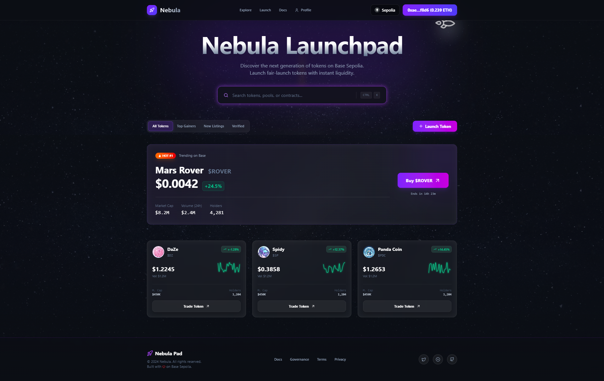
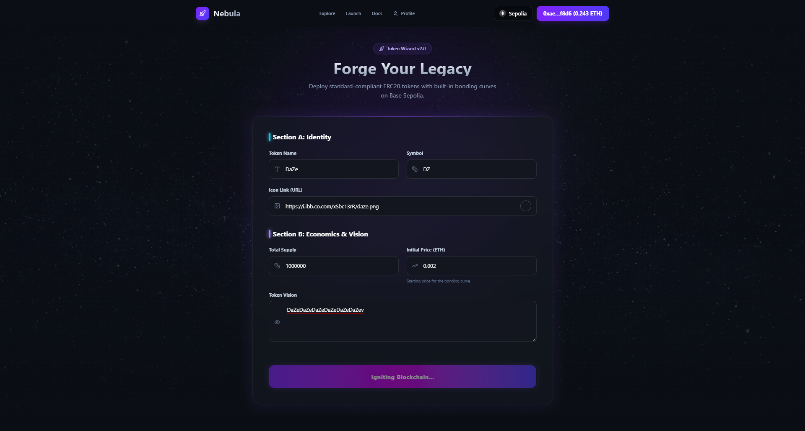
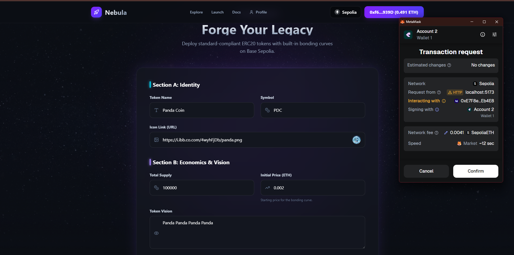
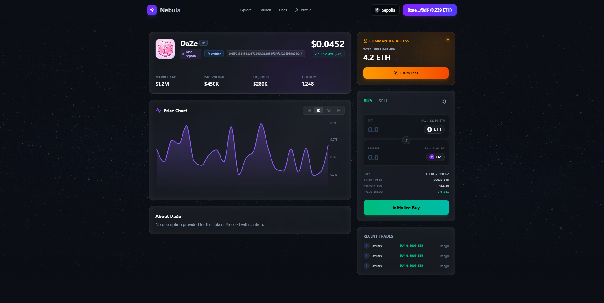
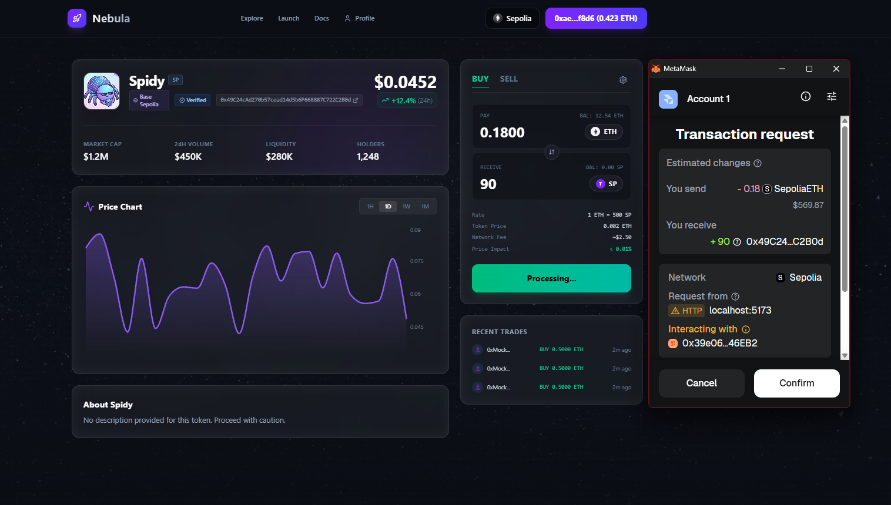
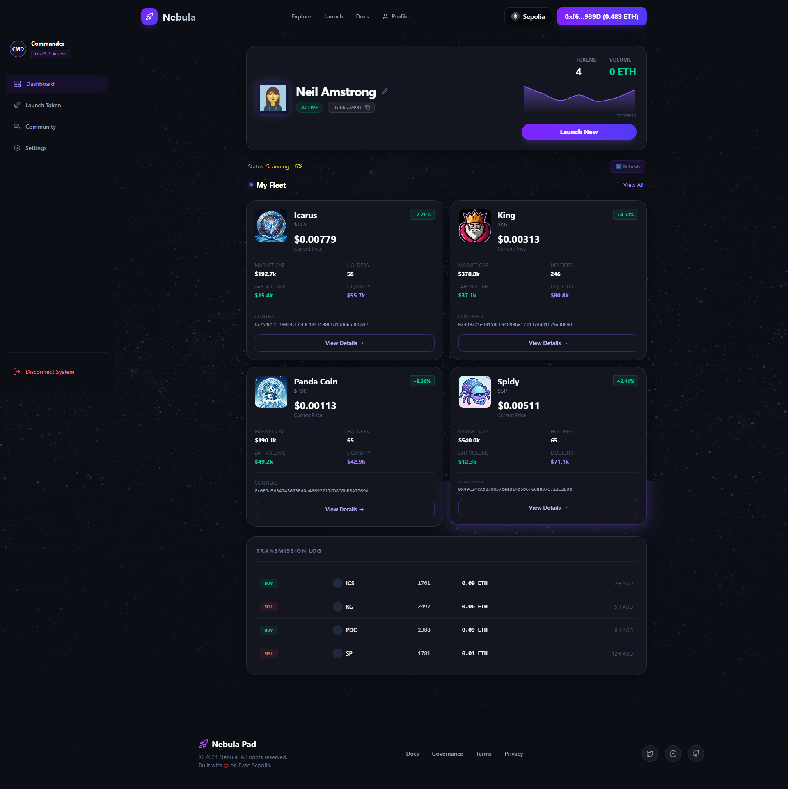
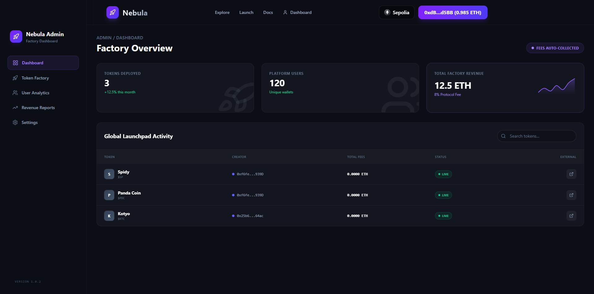
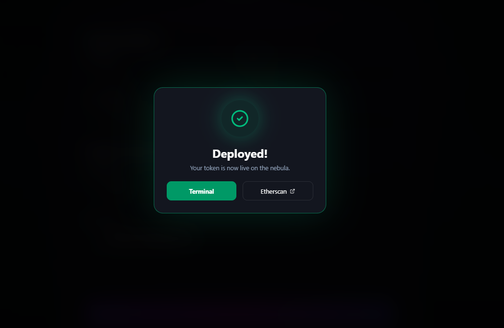

# Nebula LaunchPad

Nebula LaunchPad is a decentralized platform designed to streamline the process of launching, managing, and investing in new crypto tokens. It connects project creators with investors through a seamless, secure, and user-friendly interface.

## 🚀 Key Features

*   **Network**: Live on **Sepolia Testnet** (Chain ID: `11155111`).
*   **Token Launching**: Easily create and deploy new tokens with customizable parameters.
*   **Project Showcase**: Explore a gallery of launched projects and upcoming sales.
*   **Investment Portal**: Secure interface for users to buy tokens and participate in presales.
*   **Token Management**: Dedicated dashboards for token owners to manage their projects.
*   **Admin Controls**: Comprehensive admin dashboard for platform oversight.
*   **Real-time Analytics**: Visual data on token performance and platform statistics.

---

## 🛠️ Technology Stack

### Frontend
*   **Framework**: [React](https://react.dev/) + [Vite](https://vitejs.dev/)
*   **Styling**: [TailwindCSS](https://tailwindcss.com/)
*   **Web3 Integration**: [Wagmi](https://wagmi.sh/) + [RainbowKit](https://www.rainbowkit.com/) + [Viem](https://viem.sh/)
*   **Animations**: [Framer Motion](https://www.framer.com/motion/)
*   **Charts**: [Recharts](https://recharts.org/)

### Backend (Smart Contracts)
*   **Framework**: [Hardhat](https://hardhat.org/)
*   **Contracts**: [OpenZeppelin Upgradeable](https://docs.openzeppelin.com/contracts/upgradeable)

---

## 📸 Project Walkthrough

### 1. Landing Page
The entry point to the Nebula ecosystem, featuring trending projects and platform stats.


### 2. Launch a Token
A guided process for creators to mint and configure their new tokens.



### 3. Token Profile
Detailed information about specific tokens, including price, supply, and roadmap.


### 4. Buying Tokens
Simple and secure interface for investors to purchase tokens.


### 5. Token Owner Dashboard
Tools for project owners to manage their token's settings and view status.


### 6. Admin Dashboard
Administrative view for managing the platform.


### 7. Launched Projects
Gallery of successfully launched projects.


---

## 💿 Installation & Setup

### Prerequisites
*   Node.js (v18+ recommended)
*   NPM or Yarn
*   Metamask (or any Web3 wallet)

### 1. Clone the Repository
```bash
git clone <repository-url>
cd nebula-pad
```

### 2. Frontend Setup
Navigate to the frontend directory and install dependencies:
```bash
cd frontend
npm install
```

Start the development server:
```bash
npm run dev
```
The app will be available at `http://localhost:5173`.

### 3. Smart Contract Setup
Navigate to the backend directory:
```bash
cd ../backend
npm install
```

Compile contracts:
```bash
npx hardhat compile
```

Deploy contracts (example for local hardhat network):
```bash
npx hardhat node
npx hardhat run scripts/deploy.js --network localhost
```

---

## ☁️ Deployment (Vercel)

The frontend is designed to be deployed on Vercel. Since the backend logic resides on the blockchain (Smart Contracts), the "backend" is already live on Sepolia. You only need to deploy the frontend.

### 1. Project Configuration
*   **Framework Setup**: Vercel usually detects Vite automatically.
*   **Root Directory**: Set this to `frontend` in your Vercel project settings.
*   **Build Command**: `npm run build`
*   **Output Directory**: `dist`

### 2. Environment Variables
You must configure the following Environment Variables in your Vercel Project Settings for the dApp to work:

| Variable | Description |
| :--- | :--- |
| `VITE_WALLET_CONNECT_ID` | Project ID from [WalletConnect Cloud](https://cloud.walletconnect.com/). |
| `VITE_PINATA_JWT` | JWT Token from [Pinata](https://www.pinata.cloud/) for IPFS uploads. |
| `VITE_FACTORY_ADDRESS` | The address of your deployed TokenFactory contract on Sepolia. |
| `VITE_USER_REGISTRY_ADDRESS` | The address of your deployed UserRegistry contract on Sepolia. |

---

## 📄 License
This project is licensed under the MIT License.
